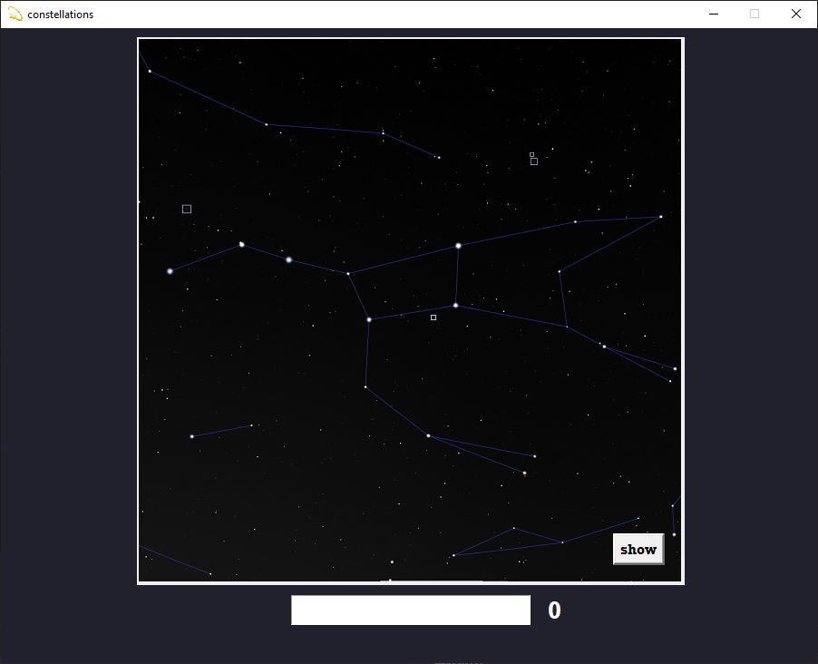

# Constellation-Flashcards
a program i made to help me learn constellations. Displays an image of a constelation (screenshot from stellarium) and if you name it correctly or press the 'show' button, the notable features of the consetllation pop up.

